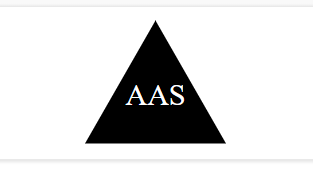
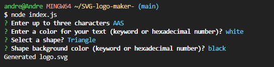
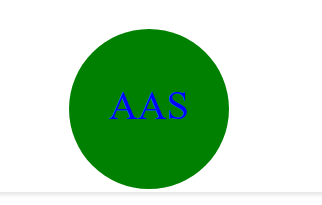
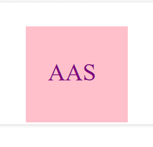

# Project Title: SVG-logo-Generator


## Description
This project uses inquirer to ask  the user some input to create the logo for exmaple the project asks the user input 3 letters, text color , and background color. And from this input the program will create a logo . And we also implemented FS in the program so we are able 

## Table of Contents
* [Installation](#installation) 
 
* [License](#license) 
 
* [Questions](#questions) 

* [Screenshot](#screenshot) 

* [Video Link](#video) 

 


## Installation Instructions
```bash
To install the project. You can clone the project on Github and then download all the necesarry dependencies and then run the program using 'node index.js'
```


## License
MIT

## Questions
​

​
If you have any questions about the repo, open an issue or contact [mynameisandreee](https://github.com/mynameisandreee) directly at anthony.santos1824@gmail.com.

## Screenshot




## Video


